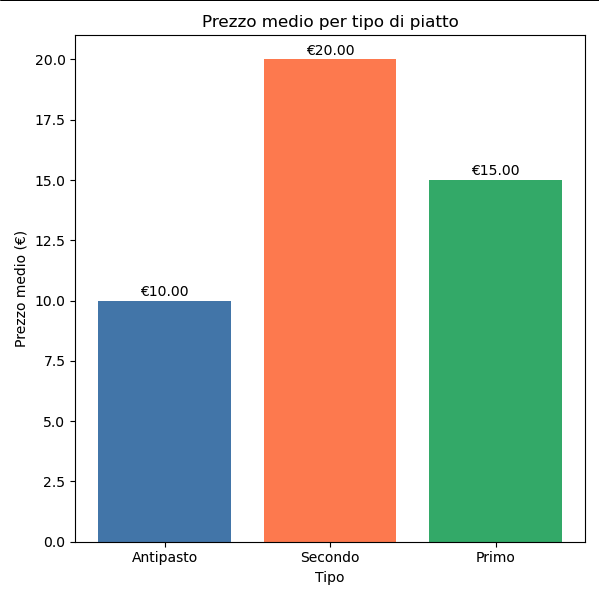
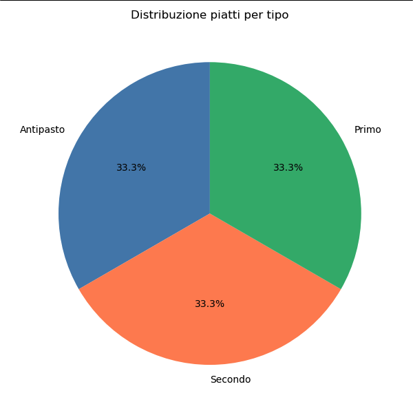

# 🍽️ Ristorante — Gestionale Intelligente

## 👤 Progetto Individuale

Progetto sviluppato per applicare i principi della Programmazione Orientata agli Oggetti in un contesto realistico di gestione ristorativa.

**Autore:** Gabriele De Carlo

---

## 🎯 Obiettivi del Progetto

- Modellare una gerarchia di piatti: **Antipasto**, **Primo**, **Secondo**
- Applicare i principi fondamentali della Programmazione Orientata agli Oggetti
- Gestire un catalogo di piatti tramite operazioni CRUD (crea, modifica, elimina)
- Leggere e scrivere dati su file **CSV** e **TXT**
- Analizzare i dati del menu tramite `filter()` e statistiche base
- Gestire la disponibilità dei piatti tramite campo booleano
- Visualizzare i dati tramite grafici con `matplotlib` *(appendice)*

---

## 🛠️ Tech Stack

- Python 3.10+
- OOP (Encapsulation, Inheritance, Polymorphism, Abstraction)
- `ABC` e `@abstractmethod` per le classi astratte
- `@property` e setter con validazione per l'incapsulamento
- __str__ come metodo speciale per la rappresentazione testuale
- `filter()` per l'analisi dei dati
- Modulo `csv` per la lettura e scrittura del catalogo
- File `.txt` per ordini e recensioni
- `matplotlib` per la visualizzazione grafica

---

## 📂 Project Structure

- `models.py` — Classe astratta `Piatto` e sottoclassi `Antipasto`, `Primo`, `Secondo`
- `gestionale.py` — Classe `Gestionale`: unico oggetto polimorfico centrale
- `file_manager.py` — Lettura e scrittura di `menu.csv`, `ordini.txt`, `recensioni.txt`
- `analisi.py` — Analisi statistiche e filtri sui dati del menu
- `visualizza.py` — Grafici con `matplotlib`
- `main.py` — Entry point e menu principale

---

## ⚙️ Setup

- Installare matplotlib: `pip install matplotlib`
- Eseguire con `python3 main.py`
- Nessun file necessario: `menu.csv`, `ordini.txt` e `recensioni.txt` vengono creati automaticamente al primo utilizzo

---

## 🧱 Core Classes

- `Piatto` — classe astratta con `@abstractmethod` su `descrivi()` e `get_tipo()`, `__prezzo` privato con `@property` e setter con validazione, `disponibile` booleano, `__str__` per rappresentazione testuale
- `Antipasto` — sottoclasse con attributo specifico `porzione`
- `Primo` — sottoclasse con attributo specifico `tipo_pasta`
- `Secondo` — sottoclasse con attributo specifico `cottura`
- `Gestionale` — classe centrale con `aggiungi()`, `cerca()`, `modifica()`, `elimina()`, `visualizza_tutti()`, `crea_piatto()`,`toggle_disponibile()`

---

## 📊 Functional Workflow

1. Avvio del programma e caricamento automatico da `menu.csv` (se esiste)
2. Inserimento manuale di piatti tramite menu CRUD
3. Modifica o eliminazione di piatti esistenti tramite codice
4. Toggle disponibilità — segna un piatto come esaurito o disponibile
5. Salvataggio del catalogo su `menu.csv`
6. Registrazione ordini e recensioni su file TXT
7. Analisi del menu (statistiche, filtro per tipo, filtro per prezzo)
8. Visualizzazione grafica tramite sottomenu dedicato

---

## 📈 Key Learning Outcomes

1. **Incapsulamento** — `__prezzo` privato accessibile solo tramite `@property` e setter con validazione
2. **Ereditarietà** — le sottoclassi ereditano da `Piatto` tramite `super()`
3. **Polimorfismo** — `.descrivi()` e `.get_tipo()` overridati in ogni sottoclasse
4. **Astrazione** — `Piatto` è classe astratta (`ABC`) non istanziabile direttamente
5. Metodi speciali — `__str__` usato attivamente con `print(piatto)` per la visualizzazione compatta
6. **Filter** — `filter()` con lambda per filtrare piatti per tipo e fascia di prezzo
7. **I/O** — lettura e scrittura con `with open`, modalità `r`, `w`, `a`, encoding UTF-8
8. **Modularità** — ogni file ha una responsabilità specifica

---

## 📊 Esempi di Output

---

## 📄 License

This project is intended for educational purposes and practical OOP training.
